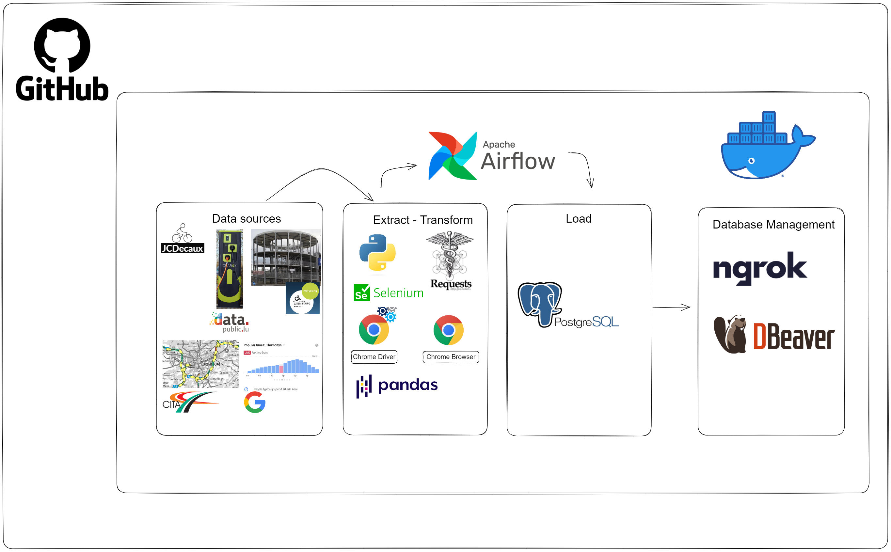

# Data Portal


## General

This repository is associated to the data portal of the University of Luxembourg managed by the [MobiLab](https://mobilab.lu/) research group.


## Framework

The data portal is based on the following framework:



- **Data sources**:
The data sources are the different data providers that are used to feed the data portal. 
    - `Bike data`: The bike data is provided by the [jcdecaux](https://api.jcdecaux.com/vls/v1/stations?contract=Luxembourg&apiKey=4507a17cda9135dd36b8ff13d8a4102ab3aa44a0) service.
    - `Charging stations data`: The charging stations data is provided by the [data public lu](https://data.public.lu) service.
    - `Traffic counters data`: The traffic counters data is provided by the [cita lu](http://www.cita.lu) service.
    - `Stops public transport data`: The stops public transport data is provided by the [mobiliteit lu](https://data.public.lu/en/datasets/api-mobiliteit-lu/) service.
    - `Departure board data`: The departure board data is provided by the [mobiliteit lu](https://data.public.lu/en/datasets/api-mobiliteit-lu/) service.
    - `Parking data`: The parking data is provided by the [Ville de Luxembourg](https://www.vdl.lu) website.
    - `Google Popular Times data`: The Google popular Times data is provided by the [Google Maps](https://www.google.com/maps) service.
<br/>
     
- **Data Extraction**:
The data extraction is performed using Python as main programming language, using libraries such as `requests`, and `selenium` with `chrome driver` and `chrome browser`. 
<br/>

- **Data Transformation**:
The data transformation is performed using Python as main programming language, using libraries such as `pandas`.
<br/>

- **Data Loading**:
Finally, the data is loaded into a [PostgreSQL](https://www.postgresql.org/) database.
<br/>

- **DB Management**:
[Ngrok](https://ngrok.com/) is used to expose the PostgreSQL database to the internet.
Then, [DBeaver](https://dbeaver.io/) is used to manage the database, even though it can be managed using other tools such as [DataGrip](https://www.jetbrains.com/datagrip/).
<br/>

The entire pipeline is containerized using [Docker](https://www.docker.com/), and it is orchestrated using [Apache Airflow](https://airflow.apache.org/).
Finally, all the resources are stored in a [GitHub](https://github.com/jdpinedaj/luxmobi) repository.


## Workflows
There are four workflows in the data portal:

- **workflow_create_tables**: This workflow creates the tables in the database. This is the first workflow that should be executed, and it is executed only once.
It is important to note that this workflow includes, among others, the execution of the file `sql/create_schemas.sql`, which creates the schemas in the database. It is necessary to comment one line in this file to execute it successfully for the first time, as it is explained in the file itself.

- **workflow_ETL**: This workflow performs the ETL process for each data source. It is executed every day at 00:00, and it is necessary to mention that the start_date of the DAG has to be set to the current date for the first time it is executed, as mentioned in the file itself.

- **workflow_load_csv_data**: In case the airflow server is down for some reason, this workflow can be executed to load the data from the CSV files that were already created by the previous workflow. It is important to note that this workflow should be executed only once, as a backup solution.

- **workflow_integration_db**: This workflow performs the integration of the data from the previous MySQL database to the current PostgreSQL database. It is important to note that this workflow should be executed only once, as a backup solution. And still has to be tested.

<!-- ---
## Connecting to the PostgreSQL database

Using ngrok to expose the PostgreSQL database to the internet:

```
ngrok tcp 5432
```

Then, use the host and port provided by ngrok to connect to the database using DBeaver or any other tool.

Example of ngrok output:


Example of DBeaver connection:


 -->

---

## Running Airflow on Docker

#### 1. docker-compose.yaml

To deploy Airflow on Docker Compose, you should fetch docker-compose.yaml.

```
curl -LfO 'https://airflow.apache.org/docs/apache-airflow/2.6.0/docker-compose.yaml'
```

In addition, please include the following element in the postgres service:

```
    ports:
        - "5432:5432"
```

#### 2. Initializing environment

On Linux, the quick-start needs to know your host user id and needs to have group id set to 0. Otherwise the files created in dags, logs and plugins will be created with root user. You have to make sure to configure them for the docker-compose:

```
mkdir -p ./dags ./logs ./plugins ./config
echo -e "AIRFLOW_UID=$(id -u)" > .env
```


#### 3. Initialize the database

First, start docker desktop:
    
```
systemctl --user enable docker-desktop
```

On all operating systems, you need to run database migrations and create the first user account. To do it, run.

```
docker-compose up -d airflow-init
```

#### 4. Cleaning-up the environment

The docker-compose we prepare is a “Quick-start” one. It is not intended to be used in production and it has a number of caveats - one of them being that the best way to recover from any problem is to clean it up and restart from the scratch.

The best way to do it is to:

- Run docker-compose down --volumes --remove-orphans command in the directory you downloaded the docker-compose.yaml file
- remove the whole directory where you downloaded the docker-compose.yaml file rm -rf '<DIRECTORY>'
- re-download the docker-compose.yaml file
- re-start following the instructions from the very beginning in this guide

#### 5. Running Airflow

Now you can start all services:

```
docker-compose up -d
```

#### 6. Extending the image to include custom packages after initialization of the database

If you want to install python requirements to the airflow container after the initialization of the database, you can do it by:

- adding the requirements to the *requirements.txt* file
- rebuilding the image docker-compose build by running `docker-compose build --no-cache`, after commenting and uncommenting the respective lines at the beginning of the *docker-compose.yaml* file.
- restarting the containers by running `docker-compose up -d`

#### 7. Accessing the environment via a browser using the web interface

Check http://localhost:8081
Or http://host.docker.internal:8081

#### 8. Airflow connection and Postgres Operator

In Airflow/Admin/Connections

- Conncection ID: `postgres_default`
- Connection type: `postgres`
- Host: `postgres` # or `host.docker.internal`
- Schema: `luxmobi`
- Login: `nipi`
- Password: `MobiLab1`
- Port: `5432`


#### 9. If there are some problems starting postgres:

```
docker exec -it luxmobi-postgres-1 psql -U nipi -d luxmobi -c "CREATE ROLE airflow LOGIN PASSWORD 'airflow';"
docker exec -it luxmobi-postgres-1 psql -U nipi -d luxmobi -c "CREATE DATABASE airflow;"
```


#### 10. Reseting Docker to start again

In case you need to reinstall everything again, you just need to run:

```
docker-compose down --volumes --rmi all
```

And then start again...


#### 11. Useful commands
    
- To see the logs of a specific container:
```
docker logs -f <container_name>
```

- To see the dag list
```
docker exec -it luxmobi-airflow-webserver-1 airflow list_dags
```


#### More info

For more info, please visit:
https://airflow.apache.org/docs/apache-airflow/stable/start/docker.html
